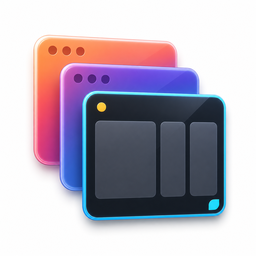

<p align="center">
  
</p>

<h1 align="center">SwitchTab</h1>

<p align="center">
  <strong>Fast, keyboard-first window and application switching for macOS.</strong>
</p>

---

## What SwitchTab Does

SwitchTab provides two focused switching modes:

- Press <kbd>Command</kbd>+<kbd>`</kbd> to move between windows in the current
  application, with live previews when Screen Recording permission is available.
- Press <kbd>Command</kbd>+<kbd>Tab</kbd> to move between applications with
  compact icons and a caption for the selected app.

Both shortcuts can be enabled, disabled, and changed independently in
Settings > Shortcut. If macOS refuses the reserved current-window default,
SwitchTab falls back to
<kbd>Option</kbd>+<kbd>Control</kbd>+<kbd>`</kbd>.

Fresh installations enable both switching modes by default. Existing
installations preserve an explicit previous application-switcher choice; when
no previous choice can be detected, application switching remains disabled.
When enabled, <kbd>Command</kbd>+<kbd>Tab</kbd> moves forward,
<kbd>Command</kbd>+<kbd>Shift</kbd>+<kbd>Tab</kbd> moves backward, and releasing
Command activates the selected app. Turning the setting off or quitting
SwitchTab restores the native switcher.

Only the selected application shows its name. When Accessibility reports two or
more standard windows for that app, the caption also shows the window count.
Arrow keys move through the same selection grid, and
<kbd>Command</kbd>+<kbd>Q</kbd> asks the selected app to quit normally while the
switcher stays open; the tile disappears only after that app exits.

Accessibility permission is required for window focus and application
switching. Screen Recording is required only for window previews, not for
application icons or names. If Cmd-Tab interception is unavailable, SwitchTab
keeps the setting saved, shows recovery guidance, and leaves native Cmd-Tab
working.

## Free Forever

SwitchTab is free, and it stays free. There are no ads, no in-app purchases, no
subscription, and no paid Pro tier — every feature is available to everyone,
with nothing held back behind a paywall.

The app bundles no advertising SDK and has no third-party runtime dependency
other than Sparkle, which is present only in the direct-distribution build so it
can deliver updates.

## Requirements

- macOS 14.0 or later
- Swift 6 toolchain or Xcode with Swift 5.10+

## Quick Start

Open `SwitchTab.xcodeproj` in Xcode, select the `SwitchTab` scheme, then use
`Product > Build` or `Product > Test`.

For command-line development:

```bash
swift build
swift test
```

## Documentation

- [Development](docs/development.md) — local setup, build, test, and verification
- [AI context and verification](docs/AI_CONTEXT.md) — current architecture, invariants, and compact macOS QA guidance
- [Project history](docs/PROJECT_HISTORY.md) — task-selective decisions, rationale, changed requirements, and release evidence
- [Direct distribution](docs/direct-distribution.md) — generated Sparkle workspace and signed DMG builds
- [Update hosting](docs/update-hosting.md) — Cloudflare R2, Sparkle publishing, and local fallback operations
- [Release workflow](docs/release-workflow.md) — versioning, GitHub releases, Homebrew integration, and recovery
- [Repository maintenance](docs/repository-maintenance.md) — dependency, security, and verification state
