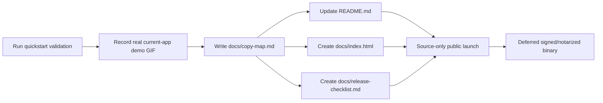
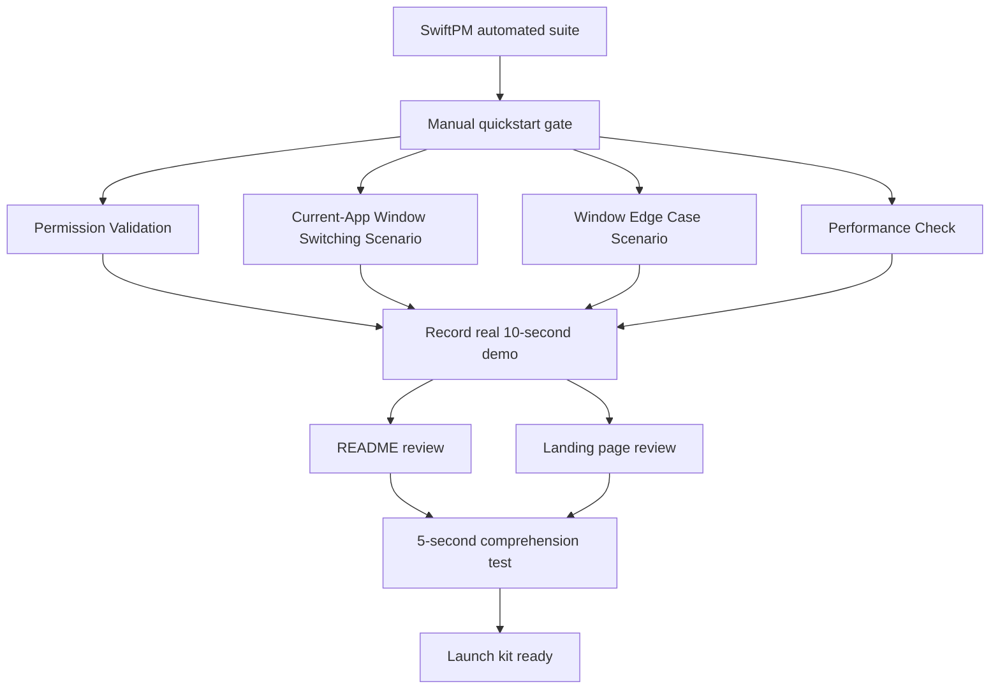

# SwitchTab Launch Kit Implementation Plan

Generated by /plan-eng-review on 2026-07-01.

## Scope

Build the first open-source launch kit for SwitchTab without changing runtime
app behavior. The launch kit explains the current-app window switching moment,
shows a real validated demo, gives source-build instructions, and makes the
permission and distribution state explicit.

Primary implementation files:

- `README.md`
- `docs/index.html`
- `docs/release-checklist.md`
- `docs/copy-map.md`
- `docs/assets/switchtab-current-app-demo.gif`

## Assumptions

- Public name remains `SwitchTab`.
- `docs/index.html` is the static landing page location.
- First launch state is source-only unless Developer ID signing and notarization
  credentials are available before implementation starts.
- The demo asset must be recorded from the real app after manual validation
  passes.

## Not In Scope

- Signed or notarized binary release.
- GitHub Release upload or binary asset publication.
- Homebrew cask, Sparkle updates, or any auto-update mechanism.
- Runtime app feature fixes discovered while recording the demo.
- New telemetry, accounts, remote analytics, or hosted backend services.
- Public competitor callouts or attack copy.

## What Already Exists

- `README.md` has the project name, requirements, build/test instructions, and
  the current-app switching focus.
- `specs/001-macos-window-switcher/quickstart.md` defines the live macOS manual
  validation paths, including permission validation, current-app window
  switching, window edge cases, and performance.
- `specs/001-macos-window-switcher/plan.md` defines the native macOS app shape,
  permission constraints, and performance goals.
- `WindowSwitcherTestRunner` is available through SwiftPM, and the current run
  passed with `swift run WindowSwitcherTestRunner`.
- `docs/` does not exist yet, so this pass creates the launch surface from
  scratch.

## Architecture

The launch kit is a docs-only layer over the validated app behavior:

GitHub Pages can publish from a repository `/docs` folder, so `docs/index.html`
is a low-friction static site path. GitHub Releases can later attach binary
assets, but that remains deferred until signing, notarization, checksum, and
clean-account install validation are ready.

## Review Findings

- [P1] The demo is a launch blocker. The approved design requires the demo to be
  recorded from real app behavior after manual validation; if the demo does not
  communicate the value clearly, stop launch work and create an app-quality task.
- [P2] Copy drift is likely unless `docs/copy-map.md` is canonical. Keep the
  positioning, CTA state, permission copy, privacy copy, and FAQ answers there,
  then derive README and landing copy from it.
- [P2] CTA state must match distribution reality. Before a signed/notarized
  release exists, the primary CTA is `Build from source`, not `Download for Mac`.
- [P2] The hero GIF can become the main page performance risk. Keep the demo
  short, optimized, and locally referenced, and verify mobile/desktop layout.

## Test Diagram

## Failure Modes

- Manual validation fails: do not produce launch copy that implies the workflow
  is ready. File a separate app-quality task with the failing scenario.
- Demo is unclear in 5 seconds: revise app/demo capture, not only the prose.
- Screen Recording or Accessibility permission is missing during capture: record
  the blocked state only for troubleshooting docs, not the hero demo.
- GIF is too large or janky: shorten, crop, or downscale before committing.
- CTA says download before binary trust is ready: revert to source-build CTA.
- README, landing, and checklist disagree: update `docs/copy-map.md` first,
  then propagate.
- GitHub Pages is not enabled: `docs/index.html` still works as a static draft;
  enabling Pages is a repository setting step.

## Worktree Parallelization Strategy

This workspace is not currently a git repository, so do not create worktrees
inside this pass. Once the repo is initialized, use one branch for the launch kit
because the files share one copy source. Parallel review is still possible:

- Reviewer A: validate README and source-build instructions.
- Reviewer B: validate `docs/index.html` layout and first-viewport clarity.
- Reviewer C: validate `docs/release-checklist.md` against signing,
  notarization, checksum, and clean-account install steps.

Avoid parallel edits to `docs/copy-map.md`; it is the copy source of truth.

## Implementation Tasks

- T001: Run `Permission Validation`, `Current-App Window Switching Scenario`,
  `Window Edge Case Scenario`, and `Performance Check` from
  `specs/001-macos-window-switcher/quickstart.md`.
  Verify: record pass/fail notes and stop if current-app preview switching is
  not launch-ready.
- T002: Record `docs/assets/switchtab-current-app-demo.gif` from Safari or
  Chrome with three windows, showing `Cmd+\`` to preview overlay to selected
  window focus.
  Verify: demo is real app capture, about 10 seconds, and understandable without
  narration.
- T003: Create `docs/copy-map.md` as the canonical copy source.
  Verify: it includes hero message, one-sentence positioning, CTA state,
  permission copy, privacy copy, FAQ answers, and non-goals.
- T004: Update `README.md` top section around the demo and trust story.
  Verify: includes hero asset, source-build install path, permissions, privacy,
  troubleshooting, and current validation status.
- T005: Create `docs/index.html` as a static landing page.
  Verify: first viewport shows the real workflow, uses `Build from source` as
  the primary CTA, and has no competitor attack copy.
- T006: Create `docs/release-checklist.md`.
  Verify: source-only launch is complete without binary promises; signed binary
  track includes Developer ID, notarization, checksum, GitHub Release, and
  clean-account install checks.
- T007: Run launch-kit QA.
  Verify: local static page opens, links work, hero media loads, mobile and
  desktop layouts do not overlap, and the 5-second comprehension test passes for
  at least 2 of 3 target users or peers.

## Test Plan

- Automated baseline: run `swift run WindowSwitcherTestRunner` before changing
  launch docs and again if any app source changes become necessary.
- Manual app gate: run the named quickstart sections before recording the demo.
- Demo gate: confirm the committed demo is real app behavior and not a
  reconstructed animation.
- Docs gate: check README, landing, copy map, and release checklist for
  agreement on CTA, permissions, privacy, and release state.
- Layout gate: open `docs/index.html` locally at desktop and mobile widths.
- Asset gate: keep hero GIF short and optimized; if it feels slow or too large,
  reduce duration, dimensions, or frame rate before launch.
- Comprehension gate: show the first viewport for 5 seconds to 3 target users or
  peers. Pass only if at least 2 can say the app switches current-app windows
  with previews.

## Sources

- GitHub Pages publishing source:
  https://docs.github.com/en/pages/getting-started-with-github-pages/configuring-a-publishing-source-for-your-github-pages-site
- GitHub Releases:
  https://docs.github.com/en/repositories/releasing-projects-on-github/managing-releases-in-a-repository
- Apple notarization:
  https://developer.apple.com/documentation/security/notarizing-macos-software-before-distribution

## GSTACK REVIEW REPORT

- Review status: pass with conditions.
- Required gate: manual quickstart validation and real demo capture must happen
  before README/landing launch copy is treated as shippable.
- Main engineering decision: keep this as a docs/assets launch kit, not runtime
  feature work.
- Main quality decision: `docs/copy-map.md` is canonical to prevent copy drift.
- Main distribution decision: source-only first; signed/notarized binary is
  deferred until credentials and clean-install validation exist.
